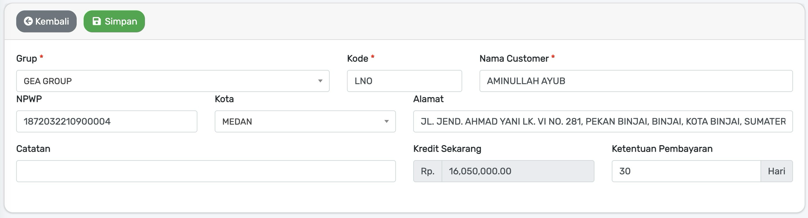

# Customer

[belum ada deskripsi]

Tampilan halaman awal `Customer` seperti di bawah ini :

## Tambah Customer

Untuk menambah data `Customer` baru bisa dilakukan dengan cara :

1. **Tekan** atau **Klik** `Tambah Data` yang ada di pojok kiri atas pada tampilan [Customer](#customer).
2. Tunggu beberapa saat maka akan tampil halaman untuk menambah data seperti di bawah ini :

3. Pada tampilan di atas, ada beberapa kolom input untuk menambahkan data :

     - **Grup** `[Harus Diisi]` 
        *apabila data `Grup` tidak ada di list maka disarankan untuk menambahkan terlebih dahulu dengan cara [Tambah Grup](master/master-grup/grup.md#tambah-grup)*
     - **Kode** `[Harus Diisi]`
     - **Nama Customer** `[Harus Diisi]`
     - **NPWP**
     - **Kota**
     - **Alamat**
     - **Catatan**
     - **Kredit Sekarang**
     - **Ketentuan Pembayaran**

4. Setelah kolom input di atas sudah diisi sesuai kebutuhan, maka kemudian bisa melakukan dengan **Tekan** `Simpan` yang ada di pojok kiri atas pada tampilan
5. Selesai.

## Ubah Customer

Untuk mengubah data `Customer` bisa dilakukan dengan cara :

1. Sesuaikan dan pastikan data mana yang akan diubah terlebih dahulu. Bisa menggunakan kolom input `Search` yang ada di pojok kanan atas pada tampilan [Customer](#customer) jika data yang di cari tidak ditemukan pada **page pertama**.
2. **Tekan** atau **Klik** `Ikon Berwarna Abu-Abu` yang ada di tabel data `Customer`, lihat tampilan di bawah :

1. **Tekan** atau **Klik** `Edit`.
2. Tunggu beberapa saat maka akan tampil halaman untuk mengubah data seperti di bawah ini :

5. Pada tampilan di atas, ada beberapa kolom input untuk mengubah data :

     - **Grup** `[Harus Diisi]` 
        *apabila data `Grup` tidak ada di list maka disarankan untuk menambahkan terlebih dahulu dengan cara [Tambah Grup](master/master-grup/grup.md#tambah-grup)*
     - **Kode** `[Harus Diisi]`
     - **Nama Customer** `[Harus Diisi]`
     - **NPWP**
     - **Kota**
     - **Alamat**
     - **Catatan**
     - **Kredit Sekarang**
     - **Ketentuan Pembayaran**

6. Setelah kolom input di atas sudah diisi sesuai kebutuhan, maka kemudian bisa melakukan dengan **Tekan** `Simpan` yang ada di pojok kiri atas pada tampilan
7. Selesai.

## Hapus Customer

Untuk menghapus data `Customer` bisa dilakukan dengan cara :

1. Sesuaikan dan pastikan data mana yang akan dihapus terlebih dahulu. Bisa menggunakan kolom input `Search` yang ada di pojok kanan atas pada tampilan [Customer](#customer) jika data yang di cari tidak ditemukan pada **page pertama**.
2. **Tekan** atau **Klik** `Ikon Berwarna Abu-Abu` yang ada di tabel data `Customer`, lihat tampilan di bawah :

1. **Tekan** atau **Klik** `Delete`.
2. Tunggu beberapa saat maka akan muncul popup konfirmasi seperti di bawah ini :

5. **Tekan** atau **Klik** `Ya`.
6. Selesai.

!> data yang sudah di hapus akan hilang pada tampilan dan hanya bisa dikembalikan atau dipulihkan dengan menghubungi pihak `IT`
