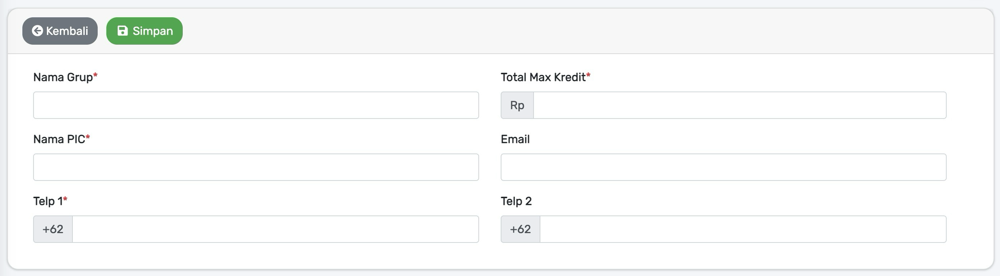
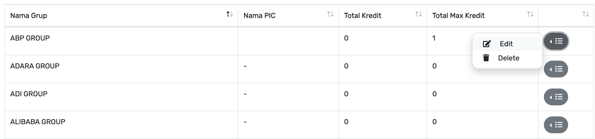
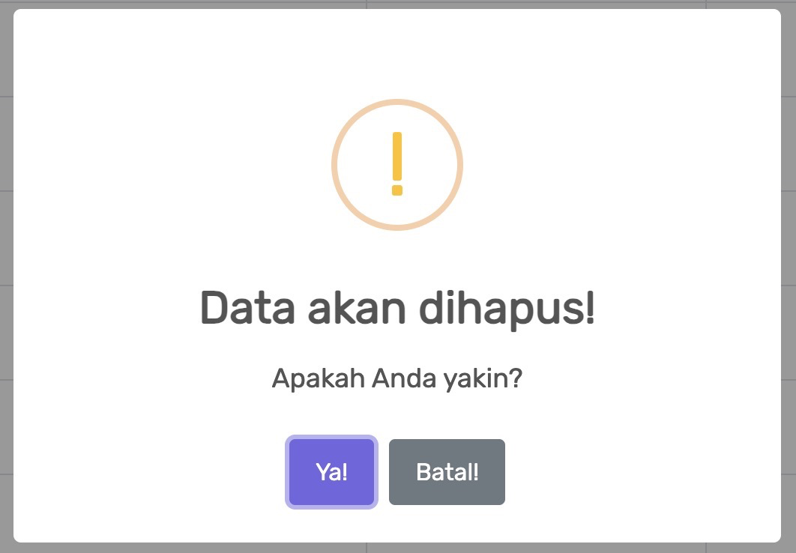

# Grup

[belum ada deskripsi]

## Tambah Grup

Untuk menambah data `Grup` baru bisa dilakukan dengan cara menekan tombol `Tambah Data` yang ada di pojok kiri atas pada tampilan [Grup](#grup). 
Setelah menekan tombol `Tambah Data`, maka akan tampil halaman untuk menambah data seperti di bawah ini :

Pada tampilan di atas, ada beberapa kolom input untuk menambahkan data :

1. **Nama Grup** `[Harus Diisi]`
2. **Nama PIC** `[Harus Diisi]`
3. **Total Max Kredit** `[Harus Diisi]`
4. **Email**.
   
  <i style="color:slategrey;">* format Email yang benar, contoh : test@test.com</i>
5. **Telp 1** `[Harus Diisi]`
   
  <i style="color:slategrey;">* format tanpa 0 di awal, contoh : 85xxxxxxxxx</i>
6. **Telp 2**
   
  <i style="color:slategrey;">* format tanpa 0 di awal, contoh : 85xxxxxxxxx</i>

Setelah kolom input di atas sudah diisi sesuai kebutuhan, maka kemudian bisa melakukan dengan menekan tombol `Simpan` yang ada di pojok kiri atas pada tampilan.

## Ubah Grup

Untuk mengubah data `Grup`, pertama kali harus menyesuaikan dan memastikan data mana yang akan diubah terlebih dahulu, bisa menggunakan kolom input `Search` yang ada di pojok kanan atas pada tampilan [Grup](#grup) jika data yang di cari tidak ditemukan.
 
Jika sudah ditemukan dan dipastikan data mana yang akan diubah, maka bisa dilanjutkan dengan cara menekan tombol `Ikon Berwarna Abu-Abu` yang ada di tabel data `Grup`, lihat tampilan di atas.
 
Setelah menekan tombol `Ikon Berwarna Abu-Abu`, maka akan muncul pop-up pilihan `Edit` dan `Delete`. Kemudian bisa dilanjutkan dengan memilih atau menekan `Edit`, setelah itu maka akan tampil halaman untuk mengubah data seperti di bawah ini :

Pada tampilan di atas, ada beberapa kolom input untuk mengubah data :

1. **Nama Grup** `[Harus Diisi]`
2. **Nama PIC** `[Harus Diisi]`
3. **Total Kredit**
4. **Total Max Kredit** `[Harus Diisi]`
5. **Email**
   
  <i style="color:slategrey;">* format Email yang benar, contoh : test@test.com</i>
6. **Telp 1** `[Harus Diisi]`
   
  <i style="color:slategrey;">* format tanpa 0 di awal, contoh : 85xxxxxxxxx</i>
7. **Telp 2**
   
  <i style="color:slategrey;">* format tanpa 0 di awal, contoh : 85xxxxxxxxx</i>

Setelah kolom input di atas sudah diisi sesuai kebutuhan, maka kemudian bisa melakukan dengan menekan tombol `Simpan` yang ada di pojok kiri atas pada tampilan.

## Hapus grup

Untuk menghapus data `Grup`, pertama kali harus menyesuaikan dan memastikan data mana yang akan dihapus terlebih dahulu, bisa menggunakan kolom input `Search` yang ada di pojok kanan atas pada tampilan [Grup](#grup) jika data yang di cari tidak ditemukan.
 
Jika sudah ditemukan dan dipastikan data mana yang akan di ubah, maka bisa dilanjutkan dengan cara menekan tombol `Ikon Berwarna Abu-Abu` yang ada di tabel data `Grup`, lihat tampilan [Ubah Grup](#ubah-grup).
 
Setelah menekan tombol `Ikon Berwarna Abu-Abu`, maka akan muncul pop-up pilihan `Edit` dan `Delete`. Kemudian bisa dilanjutkan dengan memilih atau menekan `Delete`, setelah itu maka akan muncul popup untuk konfirmasi menghapus data seperti di bawah ini :

Setelah memastikan bahwa data yang dihapus sudah benar, maka bisa dilanjutkan dengan menekan tombol `Ya` pada tampilan di atas.

  <i style="color:tomato;">* data yang sudah di hapus akan hilang pada tampilan dan hanya bisa dikembalikan atau dipulihkan dengan menghubungi pihak `IT`</i>
