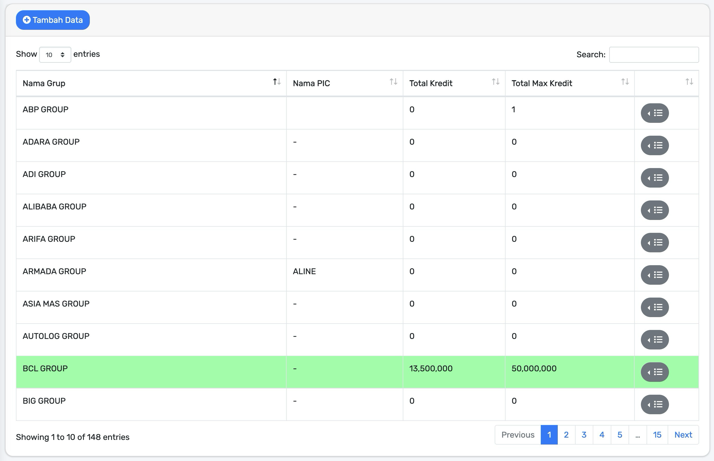
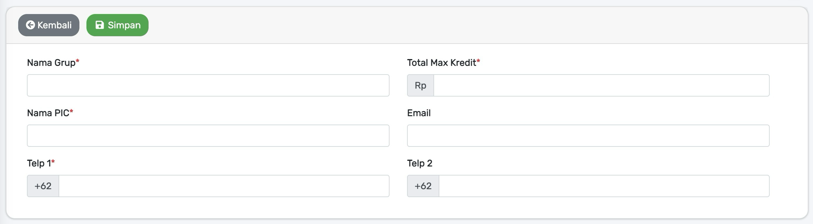
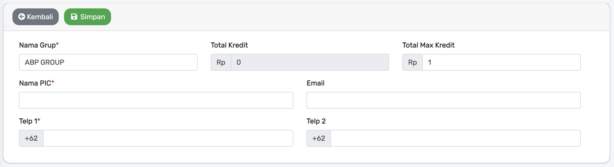

# Grup

[belum ada deskripsi]

Tampilan halaman awal `Grup` seperti di bawah ini :

## Tambah Grup

Untuk menambah data `Grup` baru bisa dilakukan dengan cara :

1. **Tekan** atau **Klik** `Tambah Data` yang ada di pojok kiri atas pada tampilan [Grup](#grup).
2. Tunggu beberapa saat maka akan tampil halaman untuk menambah data seperti di bawah ini :

3. Pada tampilan di atas, ada beberapa kolom input untuk menambahkan data :

     - **Nama Grup** `[Harus Diisi]`
     - **Nama PIC** `[Harus Diisi]`
     - **Total Max Kredit** `[Harus Diisi]`
     - **Email**. 
     - **Telp 1** `[Harus Diisi]` 
        *format tanpa 0 di awal, contoh : 85xxxxxxxxx*
     - **Telp 2** 
        *format tanpa 0 di awal, contoh : 85xxxxxxxxx*

4. Setelah kolom input di atas sudah diisi sesuai kebutuhan, maka kemudian bisa melakukan dengan **Tekan** `Simpan` yang ada di pojok kiri atas pada tampilan
5. Selesai.

## Ubah Grup

Untuk mengubah data `Grup` bisa dilakukan dengan cara :

1. Sesuaikan dan pastikan data mana yang akan diubah terlebih dahulu. Bisa menggunakan kolom input `Search` yang ada di pojok kanan atas pada tampilan [Grup](#grup) jika data yang di cari tidak ditemukan pada **page pertama**.
2. **Tekan** atau **Klik** `Ikon Berwarna Abu-Abu` yang ada di tabel data `Grup`, lihat tampilan di bawah :

1. **Tekan** atau **Klik** `Edit`.
2. Tunggu beberapa saat maka akan tampil halaman untuk mengubah data seperti di bawah ini :

5. Pada tampilan di atas, ada beberapa kolom input untuk mengubah data :

     - **Nama Grup** `[Harus Diisi]`
     - **Nama PIC** `[Harus Diisi]`
     - **Total Kredit**
     - **Total Max Kredit** `[Harus Diisi]`
     - **Email**. 
     - **Telp 1** `[Harus Diisi]` 
        *format tanpa 0 di awal, contoh : 85xxxxxxxxx*
     - **Telp 2** 
        *format tanpa 0 di awal, contoh : 85xxxxxxxxx*

6. Setelah kolom input di atas sudah diisi sesuai kebutuhan, maka kemudian bisa melakukan dengan **Tekan** `Simpan` yang ada di pojok kiri atas pada tampilan
7. Selesai.

## Hapus Grup

Untuk menghapus data `Grup` bisa dilakukan dengan cara :

1. Sesuaikan dan pastikan data mana yang akan dihapus terlebih dahulu. Bisa menggunakan kolom input `Search` yang ada di pojok kanan atas pada tampilan [Grup](#grup) jika data yang di cari tidak ditemukan pada **page pertama**.
2. **Tekan** atau **Klik** `Ikon Berwarna Abu-Abu` yang ada di tabel data `Grup`, lihat tampilan di bawah :

1. **Tekan** atau **Klik** `Delete`.
2. Tunggu beberapa saat maka akan muncul popup konfirmasi seperti di bawah ini :

5. **Tekan** atau **Klik** `Ya`.
6. Selesai.

!> data yang sudah di hapus akan hilang pada tampilan dan hanya bisa dikembalikan atau dipulihkan dengan menghubungi pihak `IT`
